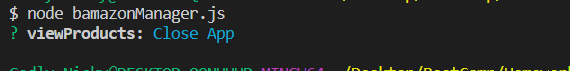

# BAMAZON

BAMAZON - 

Description: The app represents a Shopping Model (like Amazon).

<b>Instructions to Run the app</b>

1. node bamazon.js - runs the bamazon(Customer) module
2. node bamazonManager.js - runs the bamazon(bamazonManager.js)

There are two models.   
    - Customer: The interface provides means for the customer to purchase a product.

                The user is required to
                * Select an item
                * Enter the quantity required.
                If the item is in stock then the user is able to complete the transaction else 'Insufficent Quantity' displayed.

    - Manager:  The interface provides means for the Store Manager to perform the following operations.

                * View Products for Sale
                * View Low Inventory
                * Add to Inventory
                * Add New Product

Technology used:
    <li>Node.js</li>
    <li>Inquirer</li>
    <li>mysql</li>
    <li>console.table</li>

###### node bamazon.js

##Select

##View

##Buy

##Done Shopping

###### node bamazonManager.js

##View Inentory

##View Low Inventory

##Add to Inventory

##Add new Product

##Close App

